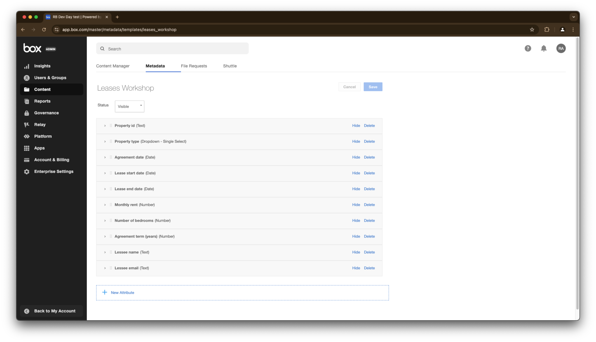
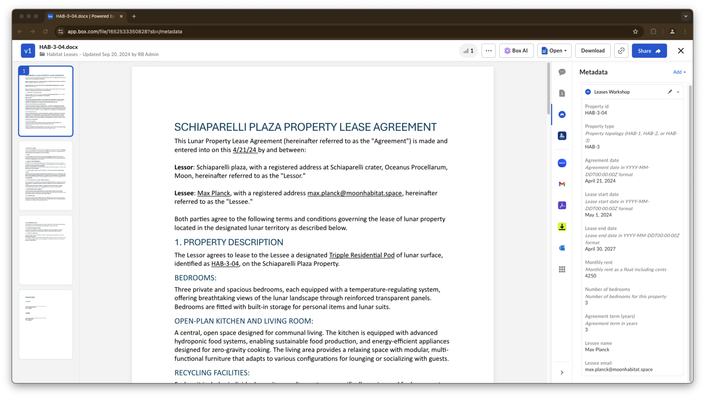

# Extract metadata

Sends an AI request to supported Large Language Models (LLMs) and returns extracted data as a set of key-value pairs, using a Box metadata template.

## Official documentation
- [Guide](https://developer.box.com/guides/box-ai/extract-metadata-structured/)
- [API reference](https://developer.box.com/reference/post-ai-extract-structured/)
- [Box metadata](https://developer.box.com/guides/metadata/)

## Setup

Because we are using Box metadata we'll need to create a metadata template first.
Run the script src/gen_sample_metadata.py to create a sample metadata template.

```bash
python src/gen_sample_metadata.py
```

Now if you navigate to the Box Admin Console and go to Metadata Templates you should see a new template called "Leases Workshop", and selecting it should show these fields:



## Workshop

To extract document data using the structure of a Box metadata template, you need to define the template key and a template scope. The template key is the unique identifier of the metadata template, and the scope is the enterprise ID. 

```python
# Metadata template config
template_key = "leases_workshop"
template_type = "metadata_template"
template_scope = f"enterprise_{conf.enterprise_id}"

# Documents
items = [AiItemBase(id=file.id, type="file") for file in hab_files]

# Extract metadata from single document
item = items[0]
metadata_template = CreateAiExtractStructuredMetadataTemplate(
    template_key=template_key,
    type=type,
    scope=scope,
)
ai_response = client.ai.create_ai_extract_structured(
    items=[item],
    metadata_template=metadata_template,
).to_dict()
print_ai_response("Extract metadata from single document", ai_response)
```

The above returns the following:
```yaml
Description: Extract metadata from single document

Answer:
{'number_of_bedrooms': 1, 'lessee_email': 'marie.tharp@moonhabitat.space', 'lessee_name': 'Marie Tharp', 'agreement_date': '2024-04-24T00:00:00Z', 'lease_start_date': '2024-05-01T00:00:00Z', 'lease_end_date': '2027-04-30T00:00:00Z', 'monthly_rent': 3125, 'property_type': 'HAB-1', 'agreement_term': 3, 'property_id': 'HAB-1-01'}
```

The next step is to take this dictionary and apply it to the document as metadata. This is done by creating a metadata object and updating the document with it.

```python
# Apply metadata to document
metadata = apply_metadata_to_document(client, item.id, template_key, ai_response)
print_ai_response("Metadata applied to document:", metadata)
```

The above returns the following:
```yaml
Description: Metadata applied to document:

Answer:
{'property_type': 'HAB-1', 'lease_end_date': '2027-04-30T00:00:00.000Z', 'lessee_email': 'marie.tharp@moonhabitat.space', 'lease_start_date': '2024-05-01T00:00:00.000Z', 'property_id': 'HAB-1-01', 'agreement_term': 3, 'number_of_bedrooms': 1, 'monthly_rent': 3125, 'agreement_date': '2024-04-24T00:00:00.000Z', 'lessee_name': 'Marie Tharp'}
```

Go ahead and execute the script `src/box_ai_extract_metadata.py` to see the data extraction process.

Take a look at the [workshop](src/box_ai_extract_metadata.py) script to see how to extract data from multiple documents.

In my case it took about 3 minutes to extract data from 50 documents. If you navigate to your Box web app and select a document you should see the metadata applied to it:


There are a few details related with metadata. From creating a metadata template to applying metadata to a document. The script[`src/utils/box_metadata.py`](src/utils/box_metadata.py) covers all these steps.